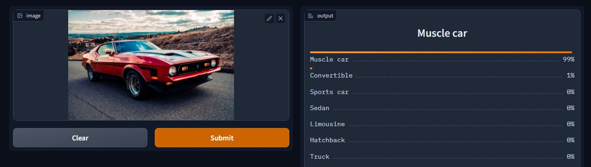

# Car-Recognizer
An image classification model from data collection, cleaning, model training, deployment and API integration.  
The model can classify 11 different types of cars  
The types are following:  
1. Bus
2. Convertible
3. Hatchback 
4. Limousine 
5. Micro 
6. Minivan 
7. Muscle car 
8. Sedan
9. Sports car
10. SUV 
11. Truck

# Dataset construction and processing
**Data Collection:** Downloaded from DuckDuckGo  using term name.  
**DataLoader:** Used fastai DataBlock API to set up the DataLoader.  
**Data Augmentation:** fastai provides default data augmentation which operates in GPU.  
Details can be found in `car_data_prep.ipynb` 

# Training and Data Cleaning
**Training:** Fine-tuned a resnet50 model three times. First 5 epochs, second and third time 3 epochs and got up to ~90% accuracy.  
**Data Cleaning:** Since I collected data from browser there were many irrelevant data and many noises. Cleaned and updated data using fastai ImageClassifierCleaner. Cleaned data each time after training or finetuning, except for the last time. There are still many irrelevant and noisy data.  

# Model Deployment
I deployed the model to HuggingFace Spaces using Gradio App. The implementation can be found in `deployment` folder or [here]( https://huggingface.co/spaces/sheikhDeep/car-recognizer).  

# API integration with GitHub Pages
The deployed model API is integrated [here](sheikhdeep.github.io/Car-Recognizer/) in GitHub Pages website. Implementation and other details can be found in `docs` folder.
